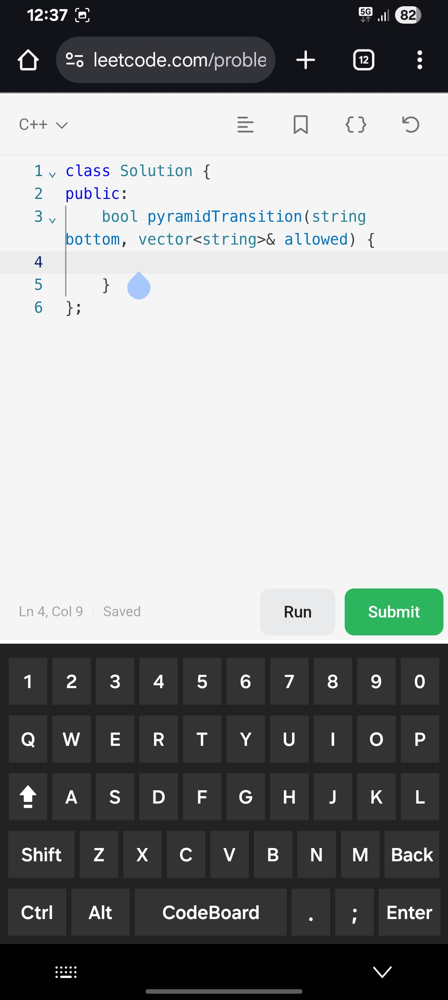

# ⌨️ Codeboard – Coding Keyboard for Developers

Codeboard is a **custom Android coding keyboard (IME)** designed to make coding on mobile devices easier, faster, and more developer-friendly.

Unlike standard keyboards, Codeboard focuses on **programming-specific keys and IDE-like behavior**, helping developers write and edit code efficiently on smartphones.

---

## 🎯 Purpose

- Provide quick access to commonly used programming symbols
- Enable IDE-style shortcuts on mobile
- Improve productivity while coding on phones
- Experiment with Android IME (Input Method Service) internals

---

## ✨ Key Features

- Dedicated keys for `{ } ( ) [ ] ; : < >`
- Arrow keys for precise cursor navigation
- Ctrl, Shift, and Tab support
- Text selection using Shift + Arrow
- Line copy / paste shortcuts
- Multiple keyboard layouts (main, numeric, special)
- Input-aware keyboard switching

---

## 🛠️ Concepts Used

- `InputMethodService`
- `InputConnection`
- IME lifecycle callbacks
- Custom keyboard layouts
- Key event handling
- Android XML + Java logic

---

## 📸 Sample App Preview

---

## 🚧 Status

This project is under active development and experimentation.  
Features and behavior may evolve as more IDE-like functionality is added.

---

📌 **Note:**  
Codeboard is built for learning and experimentation with Android system-level components.