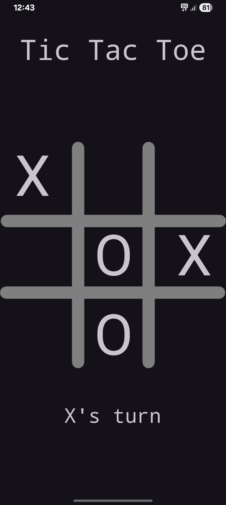

# ❌⭕ Tic Tac Toe – Android Game App

This project is a **classic Tic Tac Toe game** built as part of mobile app development practice.  
It focuses on **game logic, UI interaction, and state management** in Android.

---

## 🎯 Purpose

- Practice Android UI development
- Implement basic game logic
- Handle user interactions effectively
- Understand state updates and resets

---

## ✨ Features

- Two-player gameplay
- Interactive grid-based UI
- Win, lose, and draw detection
- Game reset functionality
- Simple and clean interface

---

## 🛠️ Concepts Used

- Button click handling
- Conditional game logic
- UI state updates
- Activity lifecycle basics
- XML layouts + Java logic

---

## 📸 Sample App Preview

---

## 🚀 Future Improvements

- Single-player mode with AI
- Improved UI animations
- Score tracking
- Sound effects

---

📌 **Note:**  
This project is created for practice and learning purposes and serves as a foundation for more advanced game logic.
